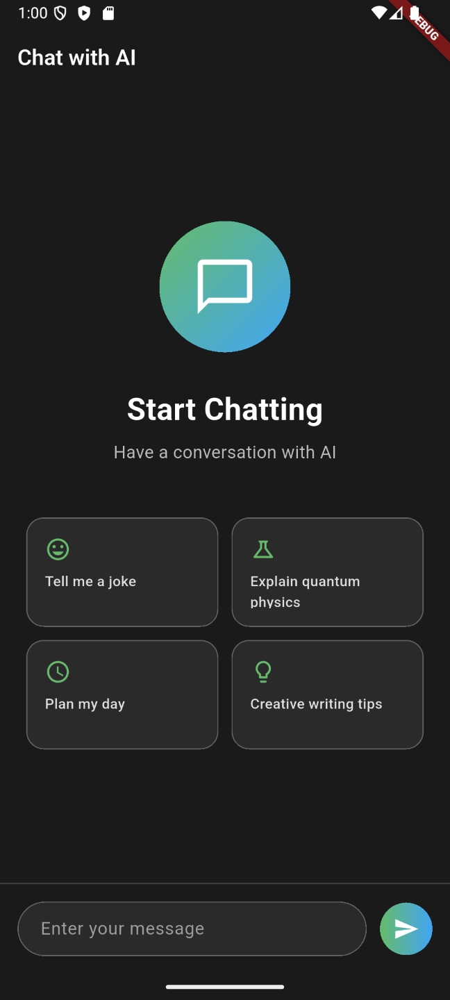

# Flutter Firebase AI Logic Example

## Scrreenshot


## Setup Firebase
1. Create Firebase App and add flutter app package name in Firebase Console.
2. Create `.env` file in the root directory of the project.
3. Add your Firebase configuration to the `.env` file:
   ```
   ANDROID_API_KEY=
   ANDROID_APP_ID=
   MESSAGING_SENDER_ID=
   PROJECT_ID=
   
   
   IOS_APP_ID=
   IOS_API_KEY=

   ```

4. Enable the following services in Firebase Console:
   - Firebase AI Logic - Gemini Developer API
5. Ready to run the app.


For help getting started with Flutter development, view the
[online documentation](https://docs.flutter.dev/), which offers tutorials,
samples, guidance on mobile development, and a full API reference.
